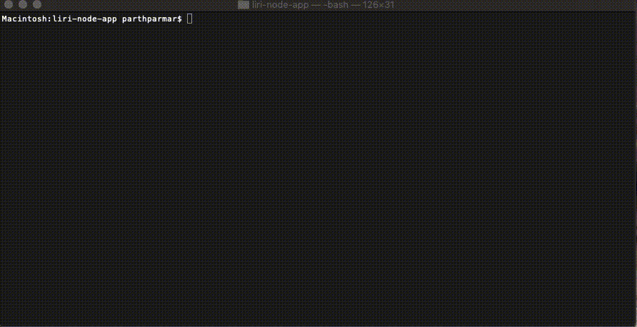

# liri-node-app

## Objective

The objective of liri-node-app is to provide a quick search tool for events, song info or movie info from the command line interface CLI.  
The app will give uses a quick way to find out the following:
- concert-this: find out events for a artist
- movie-this: find out information about for a movie
- spotify-this-song: find out information about a song
- do-what-it-says: run command and search specified in random.txt file

##  Organization

The app is organized in a few different javascript files.
- **main file** -- liri.js
    - accepts user input from CLI and calls the required API
    - outputs the results to the CLI
- **read file for search** -- read.js
    - reads random.txt file to find search requirements saved in text file 

- **output fo log file** -- log.js
    - writes given string to log.text file the search outputs

- **other** -- keys.js, .env
    - contains the necessary information used by the node-spotify-api

## How to Run

1. clone / fork repo to your computer using git commands
2. run ```npm install``` in CLI to download required node modules to run app
3. navigate to folder with file contents in CLI (e.g. terminal)
4. enter one the following lines:
    - ```node liri concert-this <artist name>``` -- find events for given artist
    - ```node liri movie-this <movie name>``` -- find movie info for given movie
    - ```node liri spotify-this-song <song name>``` -- find song info for given song
    - ```node liri do-what-it-says``` -- run the command and search item as written in random.txt file (separate command and search item by comma)
5. review log.txt file to see history of search results

## Deployment

link: None

**Local Use Only**

## Technologies Used

- npm: to install required modules
- axios: use to request data from bandsintown API and omdb API
- dotenv: loads environment variables from a .env
- moment: used to convert date & time from bansintown for event timing to a easier to read format
- node-spotify-api: to request song info from spotify
- fs: to read random.txt file and to append search results to log.txt file

## Contact

Parth Parmar -- developer of the liri app using the technologies mentioned above

## Demo


